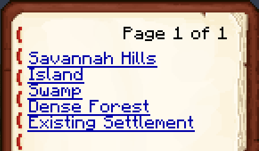

Datapack for providing a book of points of interest to teleport to.

  

## Installation

Copy the `tp` folder into the world's `datapacks` folder.  
Minimum Minecraft version: 1.20.2  

## Usage

### For organizers:

To add a new point of interest add your current location, run

    function tp:add_2d {name:"Name of the PoI"}

if teleports should place the judge on the highest solid point, or

    function tp:add_3d {name:"Name of the PoI"}

to place them at your exact position. To clear the list of locations, run

    function tp:clear

To obtain the updated book, run

    function tp:book

In multiplayer, the book will be provided to new players automatically.

### For generators:

#### Using the GDMC HTTP interface

TODO: implement an endpoint

#### Using NBT

A world's list of points of interest is stored in the file `data/command_storage_tp.dat`, which is a gzip-compressed [NBT](https://minecraft.wiki/w/NBT_format) file, under the nbt path `data.contents.data.locations`. Each element of this list is a compound tag consisting of a string `name`, float `x`, float `z` and optionaly float `y`.

In game, this can be accessed via the [`/data`](https://minecraft.wiki/w/Commands/data) command.